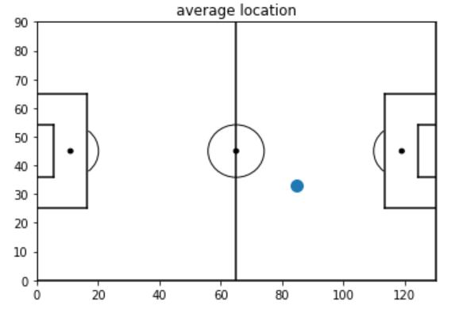

# Futsal-Image-Playing-Analysis-Service
## Goal 
Stitching multi-videos into an entire view of futsal game and analyze it by tracking players and a ball

## Camera : Top down view ( 4m ) 

## Left, Right Source Frame : filmed by smart phones 

 

## Stitched Frame 

## Tracking Frame 

## data output(hitmap,average location)

## To do list  
- [ ] perspective warping of coordinates
- [ ] add ball class
- [ ] raise the accuracy of tracking

