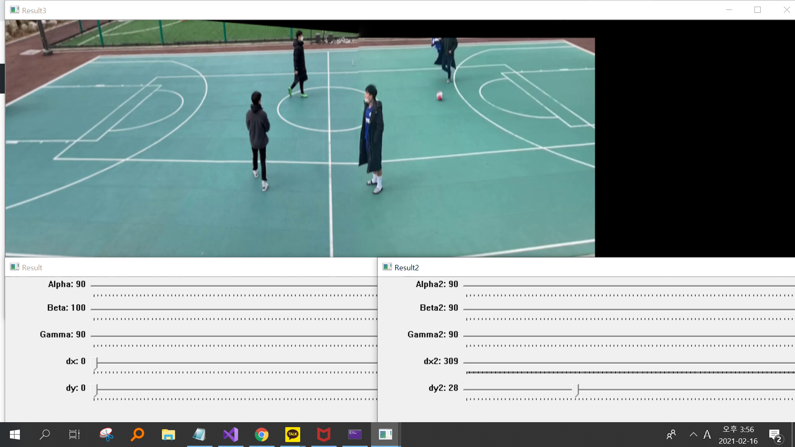

# Futsal-Image-Playing-Analysis-Service
## Goal 
Stitching multi-videos into an entire view of futsal game and analyze it by tracking players and a ball

## Camera : Top down view ( 4m ) 
We expect that we can take the top-down view by this tripod at all type of futsal field   

## Left, Right Source Frame : filmed by smart phones 

 

## Stitched Frame 
We need stitching of two videos for the entire view of the field

Warping using SIFT algorithm

Warping by user

Warping by user - crop 

## Tracking Frame 
We use DeepSORT algorithm to track multi-objects(players,ball)

Track the initial version of stitching

Track the second version of stitching + coordinate point
  

## data output(hitmap,average location)

We plot some data using .csv dtat including objects coordinate

hit map

average location

## To do list  
- [ ] perspective warping of coordinates
- [ ] add ball class
- [ ] raise the accuracy of tracking

