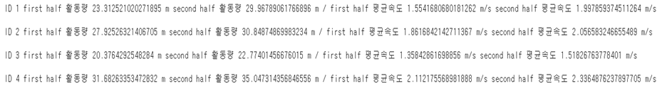

# Futsal-Image-Playing-Analysis-Service

## You can watch demo video from here : https://www.youtube.com/watch?v=t8mXEbXQEL0

## Goal 
Stitching multi-videos into an entire view of futsal game and analyze it by tracking players and a ball

## Camera : Top down view ( 4m ) 
We expect that we can take the top-down view by this tripod at all type of futsal field   

### Stitching and Tracking two videos by Tkinter GUI Program

## Open Left, Right Source Frame 

 

## Check a Pre-Stitched Frame 
We need two decide 6 points. 2 points for cropping and 4 points for converting coordinates to the real data.

Warping using SIFT algorithm(@sift_video.cpp)

Warping by user defined homography 

Warping by Cylindrical Laplcian Blending

## Tracking Frame 
We use DeepSORT algorithm to track multi-objects(players,ball)

Track the initial version of stitching (DeepSORT + YOLOv3)

Track the user defined homography stitching + coordinate point (DeepSORT + YOLOv3 , @object_trackin.py)

Track the user defined homography stitching + cooordinate point + ball class added (DeepSORT + YOLOv4)

Track the Cylindrical Laplacian stitching + coordinate point + ball class added
(DeepSORT + YOLO4)

## Data Visualization

We first have to convert pixel coordinate to real world coordination by calculating perspective homography

field width : 17.06 m / field heigth : 7.05 m (multiply 28 for easy visualization)

pixel coordinate : left-top [165,130] , left-bottom [2,270] , right-bottom [870,263], right-top [701,131]

Numerical Data1 : Activity + Speed

Visual Data1 : hit map of person_ID_1

Visual Data2 : average location of person_ID_1

Visual Data3 : minimap

original minimap

line added minimap

Flask webServer 

